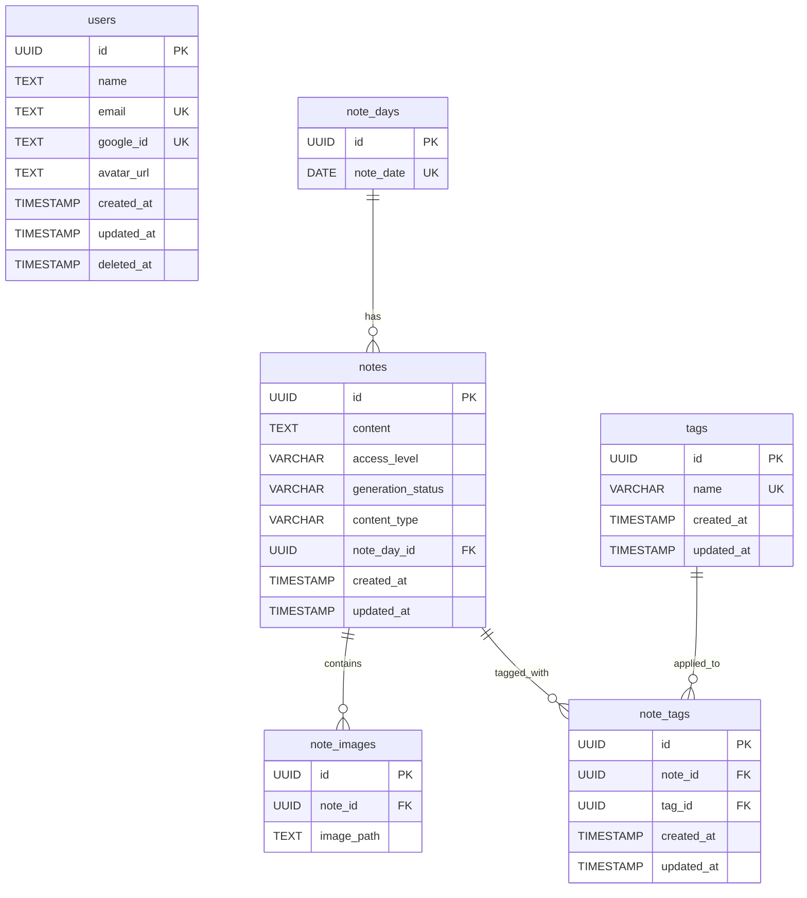

# PostNotel API Documentation

## Overview
PostNotel is a note-taking application with support for tagging, images, and different content types including AI-powered wine label recognition. The API provides efficient pagination for large datasets with comprehensive metadata including navigation flags and total counts.

## API Endpoints

### Base Configuration
- **Base URL**: `localhost:8080`
- **API Base Path**: `/v1`
- **Framework**: Gin (Go web framework)
- **Authentication**: Session-based with Google OAuth

### Health Check
- **GET** `/health`
  - **Purpose**: Health check endpoint
  - **Authentication**: None required
  - **Response**: `{"message": "UP"}`

### Authentication Endpoints (`/v1/auth`)
- **GET** `/v1/auth/google/login`
  - **Purpose**: Initiate Google OAuth login flow
  - **Authentication**: None required
  - **Response**: Returns Google OAuth URL and sets state in session

- **GET** `/v1/auth/google/callback`
  - **Purpose**: Handle Google OAuth callback
  - **Authentication**: None required
  - **Response**: Processes OAuth code and creates user session

- **POST** `/v1/auth/logout`
  - **Purpose**: Logout user and clear session
  - **Authentication**: Required
  - **Response**: `{"message": "logout success"}`

### User Endpoints (`/v1/users`)
- **GET** `/v1/users/me`
  - **Purpose**: Get current user information from session
  - **Authentication**: Required
  - **Response**: User information object

### Note Endpoints (`/v1/notes`)
- **GET** `/v1/notes`
  - **Purpose**: Get paginated notes with optional filtering
  - **Authentication**: None required (but admin status affects visibility)
  - **Query Parameters**:
    - `date` (optional): Date in YYYY-MM-DD format
    - `accessLevel` (optional): Access level filter
    - `contentType` (optional): Content type filter (note, post, winebyAI)
    - `q` (optional): Search query
    - `tagIds` (optional): Array of tag IDs for filtering
    - `offset` (optional): Pagination offset (default: 0)
    - `limit` (optional): Pagination limit (default: 100, max: 100)
    - `hasImages` (optional): Filter notes with images (true/false)
  - **Response**: Notes with comprehensive pagination metadata
    ```json
    {
      "notes": [
        {
          "noteId": "uuid",
          "content": "string",
          "accessLevel": "public|private",
          "tags": {
            "tags": [{"id": "uuid", "name": "string"}],
            "count": 0
          },
          "images": ["string"],
          "generationStatus": "done|pending|error",
          "contentType": "note|post|winebyAI",
          "createdAt": "2025-01-01 00:00:00",
          "updatedAt": "2025-01-01 00:00:00"
        }
      ],
      "pagination": {
        "total": 100,
        "count": 20,
        "offset": 0,
        "limit": 100,
        "hasNext": false,
        "hasPrevious": false
      }
    }
    ```
  - **Status Codes**: 200 (success), 204 (no content), 400 (bad request), 500 (server error)

- **GET** `/v1/notes/days`
  - **Purpose**: Get note days within specified date range
  - **Authentication**: None required
  - **Query Parameters**:
    - `start_date` (required): Start date in YYYY-MM-DD format
    - `end_date` (required): End date in YYYY-MM-DD format
  - **Response**: Array of note days or 204 if no content

- **GET** `/v1/notes/:id`
  - **Purpose**: Get specific note by UUID
  - **Authentication**: None required (but admin status affects visibility)
  - **Path Parameters**: `id` (UUID format)
  - **Response**: Note object or 404 if not found

- **POST** `/v1/notes`
  - **Purpose**: Create new note
  - **Authentication**: Required
  - **Request Body**:
    ```json
    {
      "noteDay": "YYYY-MM-DD",
      "content": "string",
      "accessLevel": "string",
      "tagIds": ["string"],
      "images": ["string"]
    }
    ```
  - **Response**: Created note object (201)

- **PATCH** `/v1/notes/:id`
  - **Purpose**: Update existing note by UUID
  - **Authentication**: Required
  - **Path Parameters**: `id` (UUID format)
  - **Request Body**:
    ```json
    {
      "content": "string",
      "accessLevel": "string",
      "tagIds": ["string"],
      "images": ["string"]
    }
    ```
  - **Response**: Updated note object

- **DELETE** `/v1/notes/:id`
  - **Purpose**: Delete note by UUID
  - **Authentication**: Required
  - **Path Parameters**: `id` (UUID format)
  - **Response**: 204 No Content

### Image Endpoints (`/v1/image`)
- **GET** `/v1/image/upload-url`
  - **Purpose**: Get pre-signed URL for image upload to cloud storage
  - **Authentication**: Required
  - **Query Parameters**:
    - `content_type` (required): MIME type (e.g., "image/jpeg")
    - `ext` (required): File extension (e.g., "jpg", "png")
  - **Response**: Pre-signed URL information for upload

### Tag Endpoints (`/v1/tags`)
- **GET** `/v1/tags`
  - **Purpose**: Get all tags
  - **Authentication**: None required
  - **Response**: Array of all tags

- **GET** `/v1/tags/:id`
  - **Purpose**: Get specific tag by ID
  - **Authentication**: None required
  - **Path Parameters**: `id` (string)
  - **Response**: Tag object or 404 if not found

- **POST** `/v1/tags`
  - **Purpose**: Create new tag
  - **Authentication**: Required
  - **Request Body**:
    ```json
    {
      "name": "string"
    }
    ```
  - **Response**: Created tag object (201)

- **PUT** `/v1/tags/:id`
  - **Purpose**: Update existing tag
  - **Authentication**: Required
  - **Path Parameters**: `id` (string)
  - **Request Body**:
    ```json
    {
      "name": "string"
    }
    ```
  - **Response**: Updated tag object

- **DELETE** `/v1/tags/:id`
  - **Purpose**: Delete tag by ID
  - **Authentication**: Required
  - **Path Parameters**: `id` (string)
  - **Response**: 204 No Content

### Wine Label Endpoints (`/v1/wine-labels`)
- **POST** `/v1/wine-labels/recognize`
  - **Purpose**: AI-powered wine label recognition to auto-generate wine notes
  - **Authentication**: Required
  - **Request Body**:
    ```json
    {
      "noteDay": "YYYY-MM-DD",
      "accessLevel": "string",
      "images": ["string"]
    }
    ```
  - **Response**: Note object (initially with pending status, processed asynchronously)
  - **Special Behavior**: Creates a note with "pending" status, then processes wine label recognition in background

## Database Schema

### Tables Overview
The PostNotel database consists of 6 main tables supporting user authentication, note organization, tagging, and image management.

### Mermaid ER Diagram


### Table Details

#### users
- **Purpose**: Stores user authentication and profile information
- **Key Features**: Google OAuth integration, soft deletion support
- **Constraints**: Unique email and google_id

#### note_days
- **Purpose**: Represents calendar dates for organizing notes
- **Key Features**: Date-based organization system
- **Constraints**: Unique note_date

#### notes
- **Purpose**: Stores the main note content and metadata
- **Key Features**: 
  - Access control (public/private)
  - Multiple content types (note, post, winebyAI)
  - Generation status tracking for AI content
- **Constraints**: Foreign key to note_days, access_level check constraint

#### note_images
- **Purpose**: Links images to notes (one-to-many relationship)
- **Key Features**: Supports multiple images per note
- **Constraints**: Foreign key to notes

#### tags
- **Purpose**: Stores reusable tags for categorizing notes
- **Key Features**: Unique tag names, timestamp tracking
- **Constraints**: Unique tag names

#### note_tags
- **Purpose**: Many-to-many relationship between notes and tags
- **Key Features**: Junction table for flexible tagging system
- **Constraints**: Foreign keys to both notes and tags

### Key Schema Features

1. **UUID Primary Keys**: All tables use UUID v7 for globally unique identifiers
2. **Soft Deletion**: Users table supports soft deletion with deleted_at timestamp
3. **Timestamp Tracking**: Automatic created_at and updated_at timestamps in JST timezone
4. **Access Control**: Notes have public/private access levels
5. **Content Types**: Support for different note types including AI-generated wine notes
6. **Flexible Tagging**: Many-to-many relationship allows multiple tags per note

### Data Types and Constraints

- **Access Levels**: "public", "private"
- **Generation Status**: "pending", "done", "error"
- **Content Types**: "note", "post", "winebyAI"
- **Timestamp Format**: "2006-01-02 15:04:05" (JST)
- **UUID Format**: Version 7 UUIDs for all primary keys

## Architecture Features

- **Middleware**: Authentication, CORS, security headers, logging, database connection, session management
- **Documentation**: Swagger/OpenAPI documentation available
- **Database**: PostgreSQL with UUID primary keys and soft deletion
- **Cloud Storage**: Integration with R2 (Cloudflare) for image storage
- **AI Integration**: Wine label recognition using AI services
- **Session Management**: Cookie-based sessions with Google OAuth
- **Validation**: Request validation using Ozzo validation library
- **Pagination**: Efficient pagination with single-query data retrieval and comprehensive metadata
  - **Default Limit**: 100 items per page (configurable via constants)
  - **Metadata**: Total count, current page count, navigation flags (hasNext/hasPrevious)
  - **Performance**: Optimized SQL queries with `COUNT() OVER()` window functions

## Migration History

1. **20241022122151**: Created users table with Google OAuth support
2. **20241123063332**: Created note_days table for date organization
3. **20241123063825**: Created notes table with content and access control
4. **20241123064352**: Created note_images table for image attachments
5. **20241123065421**: Created tags table for categorization
6. **20241123065500**: Created note_tags junction table for many-to-many relationships
7. **20250614233622**: Enhanced notes table with generation_status and content_type support